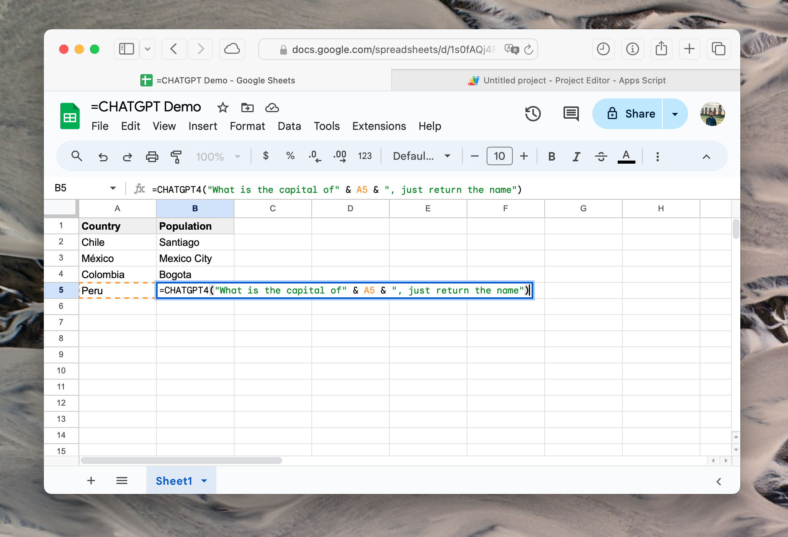

# =CHATGPT() formula for Google Spreadsheet

This is a simple formula that allows you to use OpenAI's ChatGPT API in Google Sheets. It's a simple way to generate text using GPT-3 directly in your Google Sheets.



## Installation

Here's a quick demo of how to use the formula:


1. Open your Google Sheet.
2. Go to `Extensions` -> `Apps Script`.
3. Paste the code from [`Code.js`] into the script editor.
4. Save the script.
5. Use the formula `=CHATGPTKEY("YOUR_API_KEY")` in any cell.
    * Get your API key from OpenAI's website: https://platform.openai.com/api-keys
    * You can delete this cell to remove the API key from the sheet, it's saved in your personal script properties.
6. Use the formula `=CHATGPT("Hello, how are you?")` in any cell to generate text.

To compose a complex prompts concatenating multiple cells, you can use the `&` operator. For example: 

```
=CHATGPT("What is the difference between: " A1 & " and " & A2)
```

### Formulas

* `=CHATGPTKEY("YOUR_API_KEY")`: Set your API key.
* `=CHATGPT("prompt")`: Generate text based on the prompt, defaulting to **GPT-3.5-turbo**.
    * Has two optional parameters: `model=gpt-3.5-turbo` and `max_tokens=150`.
* `=CHATGPT4("prompt")`: Generate text based on the prompt using **GPT-4o**.
    * Has one optional parameter: `max_tokens=150`.
* `=CHATGPT3("prompt")`: Generate text based on the prompt using **GPT-3.5-turbo**.
    * Has one optional parameter: `max_tokens=150`.
